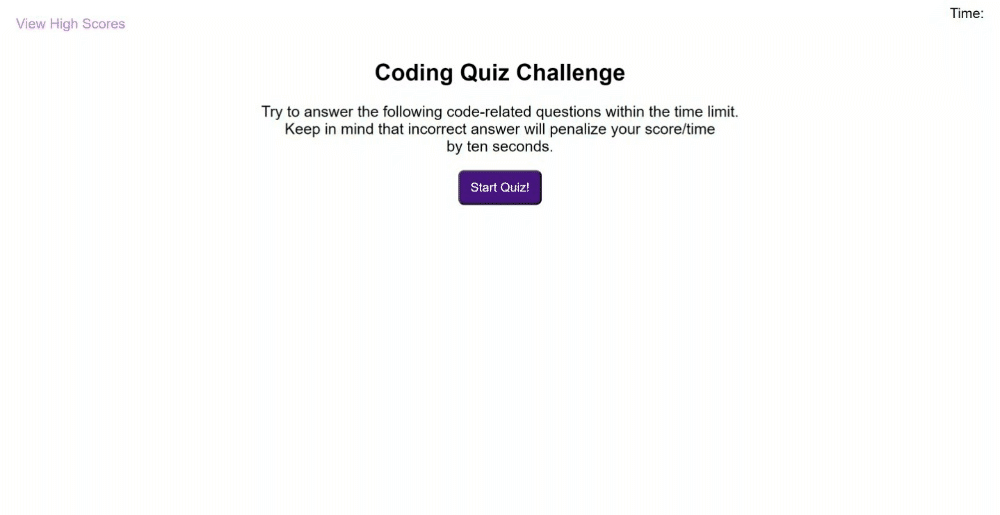

# Coding Quiz

## Description

This is a timed multiple choice quiz that challenges the user to test their coding knowledge. It's intended to help prepare candidates for their interview coding assessment.

## Installation

N/A

## Usage
Begin by clicking on the "Start Quiz!" button, the timer starts counting down and the user will be prompted with a series of questions about coding. If the choice selected is incorrect, the timer will reduce by 10 seconds. When the quiz is finished or when the time is up, the user will see their total score and will be able to enter their initials to store their score. After entering the initials, the user will be taken to the score board where it will display the record of test results; an alert will pop up if the user fail to provide their initials.

Link to the deployed application: https://jasmineleeyt.github.io/coding-quiz/

Screenshot of the website:

## Credits

I used W3Schools & Mozilla to search up the methods and statements to use: 
- https://www.w3schools.com/ 
- https://developer.mozilla.org/en-US/

## License

Please refer to the LICENSE in the repo.